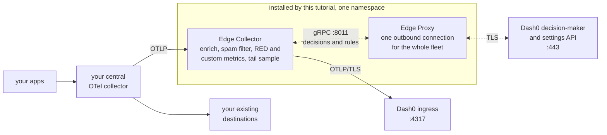

# Dash0 SignalControl on the edge - tutorial

> [!WARNING]
> ## ⚠️ NOT FOR PRODUCTION USE ⚠️
>
> **This repository is temporary documentation for prototypes.**
>
> Everything here (the charts, the manifests and the guides) exists to support prototyping and
> evaluation only. It is not supported, not hardened, and not covered by any stability guarantee.
> Contents can change or disappear without notice, and there is no upgrade path.
>
> **Do not deploy this to a production cluster or point it at production telemetry.**

Run [Dash0](https://www.dash0.com) SignalControl in your own Kubernetes cluster. Two workloads go
into one namespace.

The **Edge Collector** is an OpenTelemetry Collector in gateway position: your
central collector sends it OTLP, and it enriches, spam filters, derives RED and custom metrics from
100% of the signal, tail samples, then exports what survives to Dash0.

The **Edge Proxy** gives that
collector fleet one outbound connection for the sampling decision stream and the rule feed instead
of one per pod. Rules live in Dash0 and are pushed out live, with no redeploy and no restart.

Nothing in front of your central collector changes.

## Overview



_Solid arrows are telemetry, dotted arrows are the control plane. Your existing destinations keep
receiving exactly what they receive today._

## Prerequisites

| Item              | Detail                                                                                                                                                                                                                       |
|-------------------|------------------------------------------------------------------------------------------------------------------------------------------------------------------------------------------------------------------------------|
| Dataset           | Must already exist. Create it under Settings, Datasets.                                                                                                                                                                      |
| Auth token        | Starts with `auth_`. Needs ingest and read access to that dataset. A token restricted to a different dataset fails every export while every pod stays Ready.                                                                 |
| Role              | Admin on the organisation, required to create sampling rules.                                                                                                                                                                |
| Region and domain | As they appear in your Dash0 URL, for example `eu-west-1` and `aws.dash0.com`. Together they produce all three endpoints, and each endpoint can also be pinned individually.                                                 |
| Kubernetes        | 1.27 or newer, with Helm 3.16 or 4.x (both validated) or `kubectl` alone.                                                                                                                                                    |
| Capacity          | About 2 CPU and 10 GiB schedulable memory for the shipped sizing: 3 collector pods at 3 GiB requested, 3 Edge Proxy pods at 256 MiB.                                                                                         |
| Egress, TCP       | `decision-maker.<region>.<domain>:443` and `api.<region>.<domain>:443` for the Edge Proxy, `ingress.<region>.<domain>:4317` for the collector, `ghcr.io:443` and `pkg-containers.githubusercontent.com:443` for image pulls. |
| Images            | Public and multi-arch: no pull secret, no allowlist, no `latest` tag. Mirror them if your cluster pulls only from an internal registry.                                                                                      |

## Get the files

```sh
git clone https://github.com/dash0hq/signal-control-edge-tutorial.git
cd signal-control-edge-tutorial
```

Every command in the install pages is run from that directory.

## Install

Two paths. Same two workloads, same collector configuration, same parameters. Pick one.

| Path                                 | Use it when   | Guide                                              |
|--------------------------------------|---------------|----------------------------------------------------|
| Helm chart, in [`chart/`](chart/)    | You have Helm | [docs/install-helm.md](docs/install-helm.md)       |
| kustomize, in [`kubectl/`](kubectl/) | You do not    | [docs/install-kubectl.md](docs/install-kubectl.md) |

Both paths begin by creating the dataset, before anything is deployed. Sampling rules are not a
prerequisite: until you create one you keep 100% of your traces, which is the right way to start.

## Then

* [docs/rules.md](docs/rules.md): create and manage the three rule types, spam filters, signal to
  metrics and tail sampling, with a measured worked example.
* [docs/verify.md](docs/verify.md): how to tell it is working, and what the numbers mean.
* [docs/troubleshooting.md](docs/troubleshooting.md): symptom to cause to fix.

